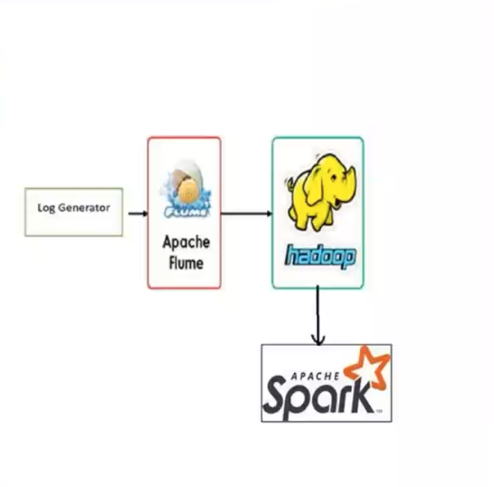

# NTI Big Data Engineering Pipeline

## Project Overview
This repository contains an end-to-end Data Engineering pipeline developed as part of the **National Telecommunications Institute (NTI) Big Data Analysis** training program. The project focuses on real-time data ingestion, distributed storage, and big data processing, demonstrating core Data Engineering concepts and ETL workflows.

## Architecture & Data Flow
The pipeline is designed to simulate real-time log generation, capture the data stream, store it in a distributed file system, and perform distributed processing and analytics.

**Data Flow:**
1. **Log Generator (Python):** Simulates a real-time application producing log entries with random users, actions, IP addresses, and severity levels.
2. **Apache Flume:** Acts as the ingestion agent, using a `TAILDIR` source to continuously read the generated logs and a memory channel to forward them to the Hadoop Distributed File System (HDFS).
3. **Hadoop (HDFS):** Serves as the central data lake, securely storing the raw streaming data.
4. **Apache Spark (PySpark):** Connects to HDFS to perform distributed data processing (e.g., WordCount operations) on the ingested logs via Jupyter Notebook.


   <p align="center">
     
   </p>


## Technologies & Tools Used
* **Programming Languages:** Python
* **Data Ingestion:** Apache Flume
* **Distributed Storage:** Apache Hadoop (HDFS)
* **Big Data Processing:** Apache Spark (PySpark)
* **Development Environment:** Jupyter Notebook, Ubuntu Linux

## Repository Structure
```text
NTI-BigData-Pipeline/
│
├── scripts/
│   └── log_gen.py          # Python script to generate real-time application logs
│
├── config/
│   └── logfile.conf        # Apache Flume configuration file (Source, Channel, Sink)
│
├── spark/
│   └── WordCount.ipynb     # PySpark notebook for data processing and analytics
│
├── assets/                 # Architecture diagrams and execution screenshots
│
└── README.md
```

## How to Run the Pipeline

### 1. Prerequisites
Ensure you have Hadoop (HDFS) and Apache Spark installed and properly configured on your system. 

### 2. Start HDFS
Format the namenode (if first time) and start the DFS daemons:
```bash
start-dfs.sh
```

### 3. Generate Logs
Run the Python script to start generating dummy application logs:
```bash
python3 scripts/log_gen.py
```

### 4. Start Apache Flume Agent
Run the Flume agent to start tailing the log file and sinking data into HDFS:
```bash
flume-ng agent -c $FLUME_HOME/conf/ -f config/logfile.conf --name a1 -Dflume.root.logger=INFO,console
```

### 5. Process Data with Spark
Launch Jupyter Notebook, open `spark/WordCount.ipynb`, and run the cells to execute the PySpark job that reads from HDFS and computes the word count.
```bash
jupyter notebook
```

## Author
* **Mohamed Nagah**
* [LinkedIn](https://linkedin.com/in/mohamednagah13) | [Email](mo.nagah2003@gmail.com)
